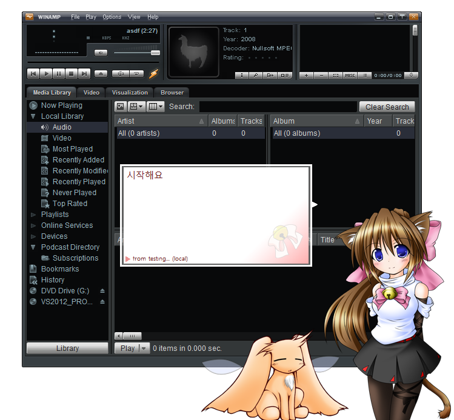

# keykanon

===============

##1. 소개
keykanon은 Sakura Script Transfer Protocol(SSTP)를 이용하여 Winamp에서 다른 프로세스로 데이터를 전송합니다.
SSTP를 사용하는 대표적인 프로그램은 Sakura Script Player(SSP)가 있습니다. 
keykanon은 기존에 존재하던 Winamp 플러그인 Yunasoft Sexyfont의 기능을 모방해 만들었습니다. Yunasoft Sexyfont는 2000년대에 만들어졌으며 2010년 후반인 현재에는 구하기 어려운 소프트웨어입니다.
keykanon은 SSP와 함께 사용하는 것을 전제로 하였기 때문에 다른 프로그램과 같이 사용하려면 SSTP 서버 기능이 필요합니다. SSP의 경우에는 SSP가 SSTP의 서버 역할을 하기 때문에 따로 서버가 필요하지는 않습니다.

- - -

##2. 기능
keykanon은 Winamp에서 재생중인 mp3파일의 가사를 다른 프로세스로 전송합니다. 이를 위해 동영상에서의 smi 파일처럼 가사 파일이 필요합니다. 가사 파일의 확장자는 .txt이며 해당하는 mp3 파일의 이름과 같아야 합니다. 예를 들어, Sample.mp3 파일의 가사 파일은 Sample.txt 입니다.
기본적으로 가사 파일의 위치는 mp3 파일의 위치와 같게 설정되어 있으나, 다른 위치로 변경할 수도 있습니다. 이 때, 변경할 경로는 절대경로로 주어져야 합니다.

- - -

##3. 적용 방법
keykanon 프로젝트는 두 개의 프로그램으로 구성되어 있습니다. 하나는 gen_keykanon.dll이고, 다른 하나는 keykanon.exe입니다.
keykanon을 Winamp에 적용하려면 gen_keykanon.dll을 Winamp 설치 폴더의 Plugin 폴더 안에 넣으면 됩니다. 
keykanon의 설정을 변경하려면 keykanon.exe를 사용하면 됩니다. keykanon.exe는 keykanon에서 사용할 변수들을 편집할 수 있습니다.

- - -

##4. 빌드 방법
현재 keykanon 프로젝트에는 Winamp 플러그인을 위한 SDK가 빠져 있습니다. 소스를 빌드하기 위해서는 Winamp SDK를 받아서 헤더를 추가해야 합니다. 다음 링크에서 Winamp SDK를 받을 수 있습니다.

[Winamp Developer Wiki](http://wiki.winamp.com/wiki/Main_Page)

- - -

##5. 편집
keykanon에서 편집 가능한 변수는 다음 7가지가 있습니다.

    사용(Usage) : SSTP를 사용할 것인지 정합니다. 기본 TRUE입니다.
	IP : Sakura Script를 받을 대상의 IP입니다. 기본 127.0.0.1입니다.
	Port : Sakura Script를 받을 대상의 포트 번호입니다. 기본 9801입니다.
	Offset : 가사가 재생되는 시간을 조절합니다. 1000느리게라면 가사가 1초 느리게 나옵니다. 기본 0입니다.
	
	가사 위치 : 가사를 찾을 위치입니다. 비어있다면 mp3 파일과 같은 폴더에서 찾습니다. 기본 비어있습니다.
	시작/종료 스크립트 : Winamp 시작/종료시 보낼 스크립트입니다.

- - -

##6. Release Note
Feb. 02 2017
>First Release